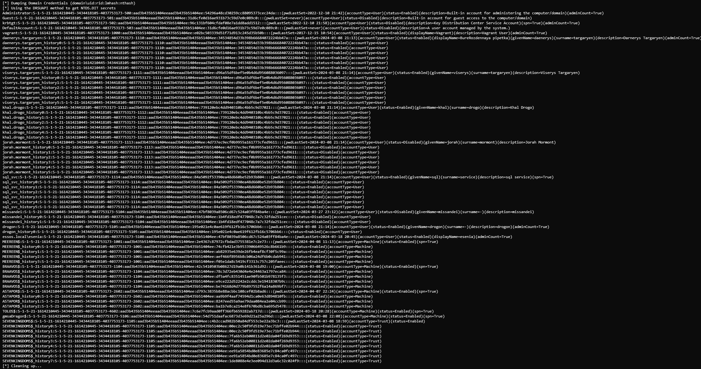

Update secretsdump.py
========

Добавлены новые флаги для извлечения вспомогательной информации. Поддерживаются все методы (LOCAL, VSS, DRSUAPI).
- `-sid` - заменяет вывод RID на SID (например, 500 → S-1-5-21-1614210445-3434418105-4037753173-500);
- `-account-type`- выводит тип учетной записи (User, Machine, Trust);
- `-display-name` - выводит дополнительные атрибуты учетной записи:
	- `displayName (ATTm131085, 1.2.840.113556.1.2.13)`;
	- `givenName (ATTm42, 2.5.4.42)`;
	- `surname (ATTm4, 2.5.4.4)`.
- `-desc` - выводит Description учетной записи:
	- `description (ATTm13, 2.5.4.13)`.
- `-service` -  выводит информацию о наличии SPN у учетной записи:
	- `servicePrincipalName (ATTm590595, 1.2.840.113556.1.4.771)`.
- `-admin-count`  выводит информацию об активном флаге adminCount у учетной записи:
	- `adminCount - (ATTj589974, 1.2.840.113556.1.4.150)`.
- `-full`  активирует (заменяет) вышеперечисленные флаги, а также базовые:
	- `-user-status`;
	- `-history`;
	- `-pwd-last-set`.

В случае, если один из атрибутов для учетной записи не существует, информация не выводится.

Информация о статусе, типе учетной записи и SID (`-user-status`,`-account-type`,`-sid`) дублируется для каждой записи истории (`-history`).

**Примеры:**

DRSUAPI (DCSync):
```bash
secretsdump.py essos.local/daenerys.targaryen:'BurnThemAll!'@meereen -just-dc-ntlm -full -outputfile essos.local
```
LOCAL:
```bash
secretsdump.py LOCAL -ntds 'ntds.dit' -system 'SYSTEM' -just-dc-ntlm -full -outputfile essos.local
```



**Для дальнейшего восставления паролей из NT-хешей, можно воспользоваться следующей командой:**


```bash
grep 'accountType=User' essos.local.ntds | cut -d ":" -f 4 | sort -us | tee ueh-uniq-nt.txt
```
